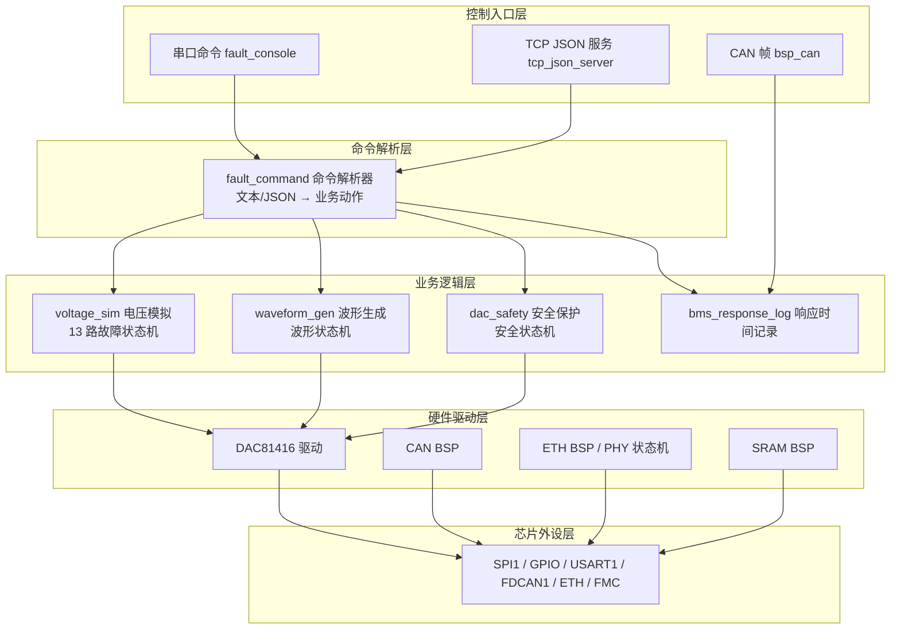
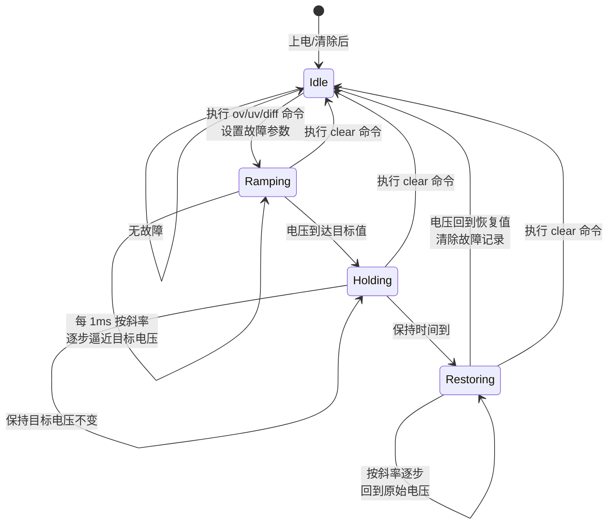
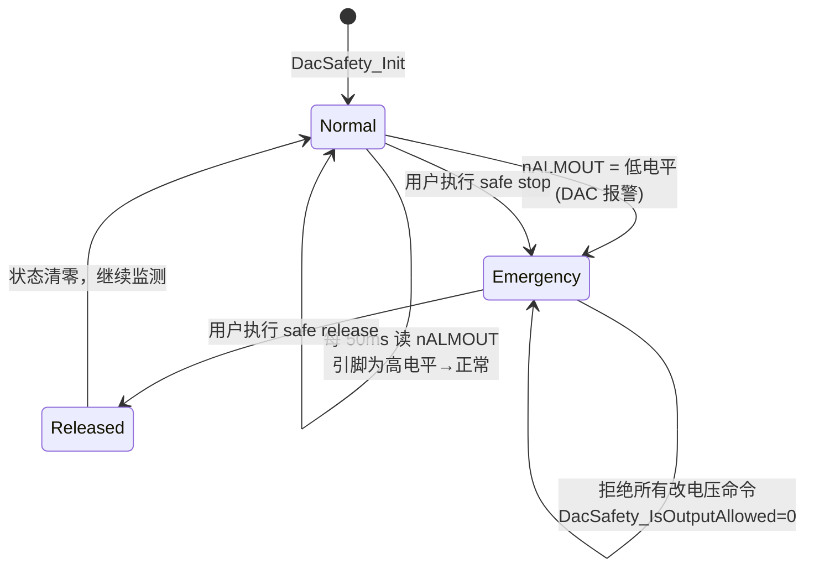
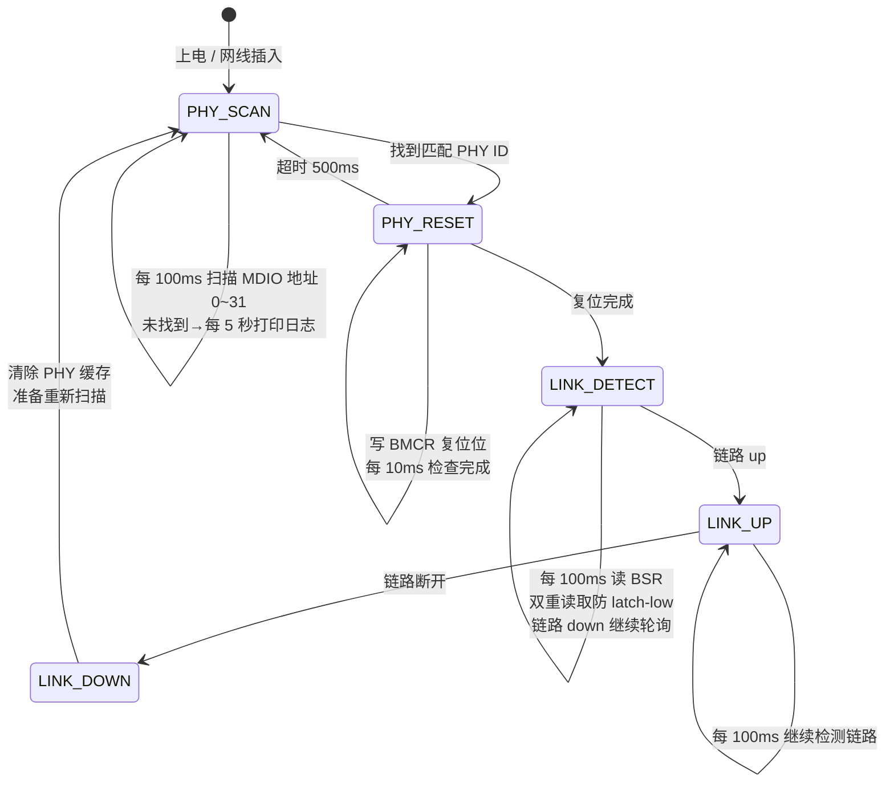
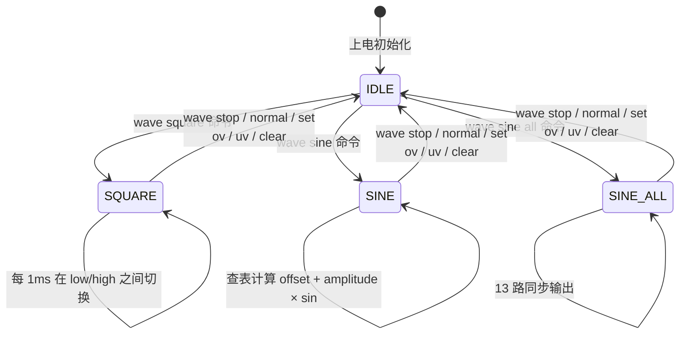
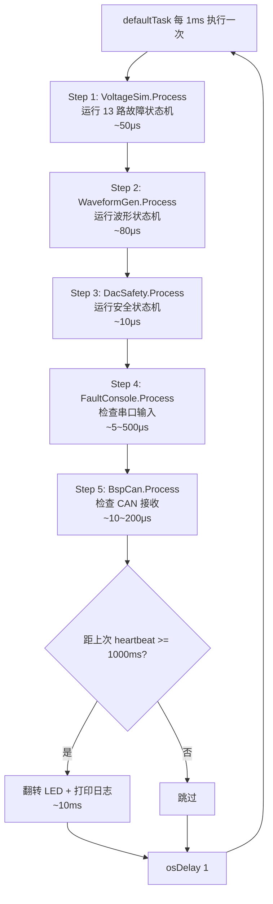
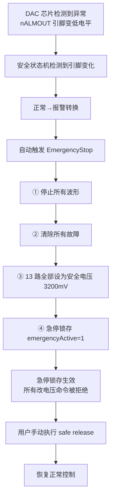
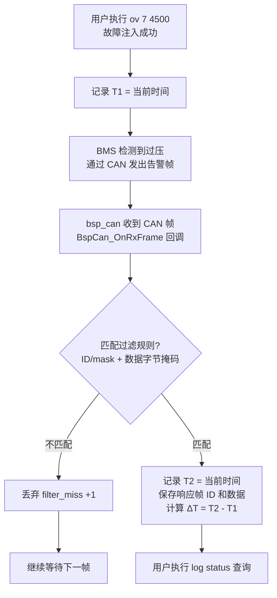
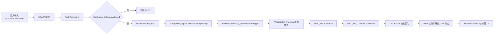

# ZhiYun BMS 故障模拟器 — 项目架构流程图

本文结合 `项目分层架构与接口说明.md` 和当前源码，用流程图说明系统的整体架构、各模块的输入输出、状态机转换、任务调度等。所有流程图使用 Mermaid 语法，可在 VS Code 或 GitHub 中直接渲染查看。

---

## 一、软件分层架构



---

## 二、每个模块的输入、处理、输出

### 2.1 命令执行模块（fault_command）

```mermaid
flowchart LR
    subgraph 输入
        I1[一行文本 <br/>如 \"ov 7 4500 100 3000\"]
        I2[一行 JSON <br/>如 {\"cmd\":\"status\"}]
    end
    subgraph 处理
        P[判断文本还是JSON<br/>→解析参数→检查合法性<br/>→调用对应业务函数]
    end
    subgraph 输出
        O1[调用 voltage_sim 设置电压/故障]
        O2[调用 waveform_gen 启动/停止波形]
        O3[调用 dac_safety 急停/释放]
        O4[调用 bsp_can 发送 CAN 帧]
        O5[返回执行结果]
    end
    I1 --> P
    I2 --> P
    P --> O1
    P --> O2
    P --> O3
    P --> O4
    P --> O5
```

### 2.2 串口控制台模块（fault_console）

| 项目     | 说明                                  |
| ------ | ----------------------------------- |
| **输入** | USART1 串口字节流                        |
| **处理** | 每 1ms 检查→拼接完整一行（遇回车结束）→交命令解析层       |
| **输出** | 通过 `printf` 输出到串口（受 printfMutex 保护） |
| **保护** | 轮询结束后 `osDelay(1)` 让出 CPU           |

### 2.3 TCP JSON 服务模块（tcp_json_server）

| 项目     | 说明                            |
| ------ | ----------------------------- |
| **输入** | TCP 客户端通过端口 5000 发送的 JSON 文本行 |
| **处理** | 接受连接→逐行读 JSON→交命令解析层→结果写回     |
| **输出** | JSON 格式响应（如 `{"ok":true}`）    |
| **限制** | 同一时间只能服务一个客户端                 |

### 2.4 电压模拟模块（voltage_sim）—— 13 路故障状态机

| 项目     | 说明                                           |
| ------ | -------------------------------------------- |
| **输入** | 命令层的设置/故障/清除指令，系统当前时间 tick                   |
| **处理** | 每 1ms 运行 13 路故障状态机，按斜率计算电压                   |
| **输出** | 13 路 DAC 通道电压值（500~5000mV）                   |
| **参数** | 每路独立校准 offset（±500mV），故障支持斜率(mV/ms)和持续时间(ms) |

### 2.5 波形生成模块（waveform_gen）

| 项目     | 说明                           |
| ------ | ---------------------------- |
| **输入** | 命令层的启动/停止指令，系统时间 tick        |
| **处理** | 每 1ms 计算波形采样点，方波切换高低电平，正弦波查表 |
| **输出** | 1 路或 13 路波形电压值               |
| **限制** | 1ms 软件刷新，适合 < 100Hz          |

### 2.6 DAC 安全保护模块（dac_safety）

| 项目     | 说明                      |
| ------ | ----------------------- |
| **输入** | nALMOUT 引脚电平，命令层急停/释放指令 |
| **处理** | 每 50ms 读一次引脚→检测报警→自动急停  |
| **输出** | 安全状态标志（是否急停/报警/锁存）      |
| **策略** | 急停锁存期间拒绝所有改电压的命令        |

### 2.7 BMS 响应时间记录模块（bms_response_log）

| 项目     | 说明                               |
| ------ | -------------------------------- |
| **输入** | 故障注入通知，CAN 接收帧回调                 |
| **处理** | 记录 T1→逐帧检查过滤条件→匹配则记录 T2→计算 ΔT    |
| **输出** | 可通过 `log status` 查询 T1/T2/ΔT/响应帧 |
| **过滤** | 支持 ID/mask + 数据字节掩码              |

### 2.8 CAN 通信模块（bsp_can）

| 项目     | 说明                                     |
| ------ | -------------------------------------- |
| **输入** | FDCAN1 硬件 RX FIFO 中的 CAN 帧             |
| **处理** | 每 1ms 检查 RX FIFO→读帧 ID/长度/数据→更新统计→回调上层 |
| **输出** | 通过 TX FIFO 发送 CAN 帧，回调通知接收帧            |

### 2.9 DAC81416 驱动模块

| 项目     | 说明                                      |
| ------ | --------------------------------------- |
| **输入** | 寄存器读写请求（地址、数据值）                         |
| **处理** | 构造 24-bit SPI 帧→SPI1 发送→读操作再发 NOP 帧收返回值 |
| **输出** | DAC 寄存器值或通道输出电压                         |
| **保护** | 所有 SPI 操作受 FreeRTOS 互斥锁保护               |

### 2.10 以太网底层模块（ethernetif）

| 项目      | 说明                                       |
| ------- | ---------------------------------------- |
| **输入**  | LAN8720A 通过 RMII 接口的数据包                  |
| **处理**  | PHY 复位→扫描地址→软件复位(500ms 超时)→链路检测(每 100ms) |
| **输出**  | 向 LwIP 提交数据包，通过 DMA 发送数据包                |
| **热插拔** | 链路 down 自动清除缓存，下次重新扫描                    |

---

## 三、四种状态机详解

### 3.1 故障状态机（voltage_sim）—— 每路电芯独立运行 1 个



**状态说明：**

| 状态                 | 行为                         | 结束条件                              |
| ------------------ | -------------------------- | --------------------------------- |
| **Idle**（空闲）       | 什么都不做，等待故障指令               | 收到 ov/uv/diff 命令                  |
| **Ramping**（上升/下降） | 每 1ms 按 `slewRate` 向目标电压靠近 | 电压 == targetMillivolts            |
| **Holding**（保持）    | 保持目标电压不变                   | (now - holdStarted) >= durationMs |
| **Restoring**（恢复）  | 按 `slewRate` 回到故障前电压       | 电压 == restoreMillivolts           |

**代码实现：** 不是用 switch-case，而是用 `faultRestoring[]` 标志 + `cellFaultInfo[].type` 组合判断：

```text
VoltageSim_Process() 每 1ms：
  对于 13 路中的每一路：
    ├─ type == NONE → 跳过
    ├─ 当前电压 != 目标电压 → 按斜率计算下一步 → 写入 DAC
    ├─ 刚到达目标值且 faultRestoring==0 → 记录保持开始时间
    ├─ 保持时间到且 faultRestoring==0 → 设 faultRestoring=1（切到恢复阶段）
    └─ 恢复完成 → 清除故障记录，回到 NONE
```

### 3.2 安全状态机（dac_safety）



**进入 Emergency 时自动执行：**

1. `WaveformGen_Stop()` — 停止所有波形
2. `VoltageSim_ClearAllFaults()` — 清除所有故障
3. `VoltageSim_SetAllCellsVoltageMv(safe_mv)` — 设置安全电压
4. `emergencyActive = 1` — 锁存急停状态
5. `alarmLatched = 1`, `alarmCount++` — 记录报警

### 3.3 PHY 状态机（ethernetif）



### 3.4 波形状态机（waveform_gen）



---

## 四、FreeRTOS 任务配置

### 4.1 任务一览

| 任务名                      | 任务函数                     | 优先级                 | 栈大小     | 运行方式       | 创建时机            |
| ------------------------ | ------------------------ | ------------------- | ------- | ---------- | --------------- |
| **defaultTask**          | `StartDefaultTask()`     | 中等（Normal）          | 4096 字节 | 每 1ms 循环一次 | FreeRTOS 初始化时   |
| **EthIf**                | `ethernetif_input()`     | **最高（Realtime）**    | 512 字节  | 信号量触发      | LwIP 初始化时       |
| **TcpJson**              | `TcpJsonServer_Task()`   | **最低（BelowNormal）** | 2048 字节 | 阻塞等待客户端    | defaultTask 启动时 |
| **ethernet_link_thread** | `ethernet_link_thread()` | 中等（Normal）          | 256 字节  | 每 100ms 轮询 | LwIP 初始化后       |

### 4.2 defaultTask 主循环



### 4.3 为什么业务逻辑不分独立任务？

所有业务逻辑（电压、波形、安全保护）都放在 defaultTask 的 1ms 循环中，而不是分 3 个独立任务：

```text
如果分成 3 个独立任务：
【电压任务】→ 算出 C01 该输出 3201mV → 写 DAC
【波形任务】→ 算出 C01 该输出 3300mV → 写 DAC
【安全任务】→ 报警了！立刻输出 3200mV！
三个任务同时写同一路 DAC → 冲突

当前方案：放在同一个 1ms 循环按顺序执行
Step 1: 计算电压
Step 2: 计算波形
Step 3: 统一写入 DAC（只有这一步真正写硬件）
Step 4: 安全检查（报警则覆盖输出）
→ 不冲突且计算量很小（合计 < 200μs）
```

### 4.4 同步保护机制

| 同步对象             | 类型  | 保护什么   | 使用场景                    |
| ---------------- | --- | ------ | ----------------------- |
| `printfMutex`    | 互斥锁 | 串口输出   | 多任务同时 printf 防止输出交错     |
| `dacSpiMutex`    | 互斥锁 | SPI 总线 | 多任务同时访问 DAC 防止 SPI 数据错乱 |
| `RxPktSemaphore` | 信号量 | 以太网接收  | 通知 EthIf 任务有新数据包        |
| `TxPktSemaphore` | 信号量 | 以太网发送  | 通知发送任务数据包已发送完成          |

---

## 五、命令处理流程

```mermaid
flowchart TD
    A[串口收到 "ov 7 4500 100 3000"<br/>或 TCP 收到 JSON] --> B[FaultCommand_ExecuteLine 统一入口]
    B --> C{首字符是 '{' ?}
    C -->|是| D[按 JSON 解析]
    C -->|否| E[按文本命令解析]
    D --> F[解析出命令类型和参数]
    E --> F
    F --> G{检查 DacSafety_IsOutputAllowed<br/>安全状态机是否在急停中?}
    G -->|是（急停中）| H[返回拒绝]
    G -->|否（正常状态）| I[停止当前波形]
    I --> J[设置第7路故障状态机参数<br/>type=OV, target=4500, restore=当前值]
    J --> K[自动记录 T1<br/>BmsResponseLog_RecordFaultTrigger]
    K --> L[defaultTask 下一次 1ms 循环<br/>故障状态机开始逐步升压]
```

**设计原则：** 命令处理是 **"写入配置，下次循环生效"** 的模式。收到命令后只修改内部参数，实际电压变化在下一个 1ms 循环中由状态机统一驱动。

---

## 六、安全保护完整路径



## 七、BMS 响应时间记录



---

## 八、系统启动流程

```mermaid
flowchart TD
    A[上电复位] --> B[芯片底层初始化<br/>HAL_Init / 时钟 / MPU]
    B --> C[外设初始化<br/>GPIO / FMC(SRAM) / SPI1 / USART1 / FDCAN1]
    C --> D[应用模块初始化]
    D --> D1[① DAC81416 配置 0~5V 量程]
    D1 --> D2[② 电压模拟初始化 13 路 3200mV]
    D2 --> D3[③ DAC 安全保护初始化]
    D3 --> D4[④ CAN 通信初始化]
    D4 --> D5[⑤ 串口控制台初始化]
    D5 --> E[启动 FreeRTOS 调度器]
    E --> F[各任务开始运行]
    F --> F1[defaultTask: 初始化 LwIP → TCP 服务 → 1ms 循环]
    F1 --> F2[EthIf: 等待以太网数据]
    F2 --> F3[TcpJson: 等待 TCP 客户端]
    F3 --> F4[ethernet_link_thread: PHY 状态机开始扫描]
```

---

## 九、命令到输出的典型链路



---

## 十、当前已实现 vs 未实现

### 已实现

| 功能模块                    | 状态  |
| ----------------------- | --- |
| 13 路独立电压输出（500~5000mV）  | ✅   |
| 过压/欠压/压差故障注入（支持斜率和持续时间） | ✅   |
| 方波/正弦波/13 路同步正弦波        | ✅   |
| 每通道校准补偿（±500mV）         | ✅   |
| DAC 急停保护（手动+报警自动）       | ✅   |
| CAN 收发（标准帧/扩展帧）         | ✅   |
| BMS 响应时间 T1/T2 记录       | ✅   |
| CAN 帧过滤（ID/mask + 数据掩码） | ✅   |
| 串口命令控制（115200, 文本/JSON） | ✅   |
| TCP JSON 控制（端口 5000）    | ✅   |
| 以太网 PHY 驱动（含热插拔）        | ✅   |
| 外部 SRAM 自检              | ✅   |
| printf 互斥锁保护            | ✅   |
| SPI 互斥锁保护               | ✅   |

### 未实现

| 功能         | 说明                               |
| ---------- | -------------------------------- |
| 温度模拟       | 7 路 NTC 电阻切换，需增加硬件电路             |
| 高精度波形      | 当前 1ms 软件刷新，需改为 TIM+SPI DMA 硬件方式 |
| 校准参数掉电保存   | 需增加 Flash 存储模块                   |
| BMS 协议自动解析 | 需拿到 DBC 后可实现全自动解析                |
